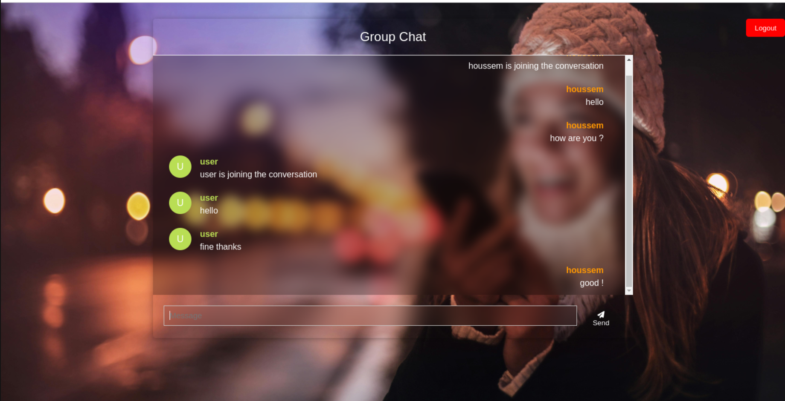
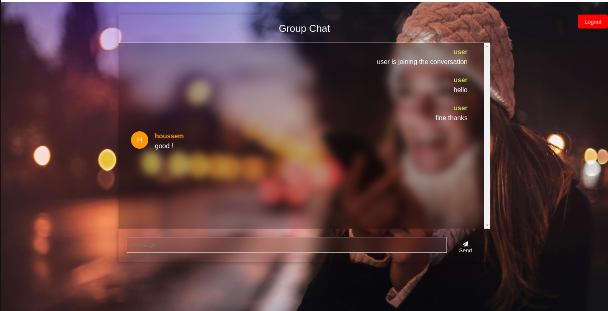
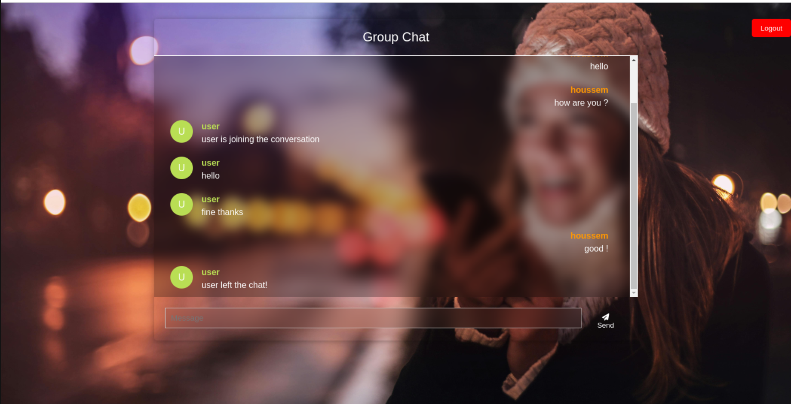

<h1>🌟 Real-time Chat Application</h1>

    <strong>Real-time Chat Application</strong> is a dynamic messaging platform built with <strong>Spring Boot</strong> and <strong>WebSocket</strong>.  
    It allows users to send and receive messages in real-time, join and leave chat rooms, and see notifications for each action.  
    This application uses the <strong>STOMP</strong> protocol over WebSockets with <strong>SockJS</strong> for better compatibility, providing a seamless real-time chat experience.

<h2>🌟 Features</h2>

<ul>
    <li>📱 <strong>Real-time Messaging</strong>: Chat in real-time with instant message delivery.</li>
    <li>✨ <strong>Join/Leave Notifications</strong>: Get notified when users join or leave the chat room.</li>
    <li>💬 <strong>Message Types</strong>: Support for different types of messages including <code>JOIN</code>, <code>CHAT</code>, and <code>LEAVER</code>.</li>
    <li>🔐 <strong>User Authentication</strong>: A simple login system based on usernames for users to join the chat room.</li>
    <li>💻 <strong>Responsive Design</strong>: Fully responsive interface optimized for both desktop and mobile devices.</li>
</ul>

<h2>🛠️ Architecture</h2>

The <strong>Real-time Chat Application</strong> follows a client-server architecture with <strong>WebSocket</strong> communication, using the <strong>STOMP protocol</strong>. Here's a breakdown of the application components:

<h3>Backend (Spring Boot)</h3>
<ul>
    <li><strong>WebSocket Server</strong>: Handles WebSocket connections and broadcasts messages to all connected clients.</li>
    <li><strong>STOMP Protocol</strong>: Used for handling messaging between the client and the server over WebSocket.</li>
    <li><strong>Session Management</strong>: Tracks user connections and disconnects, ensuring real-time updates when users join or leave.</li>
</ul>

<h3>Frontend (HTML/JS)</h3>
<ul>
    <li><strong>WebSocket Client</strong>: Uses <strong>SockJS</strong> and <strong>STOMP.js</strong> to establish a connection with the server for real-time communication.</li>
    <li><strong>User Interface</strong>: A simple chat interface for users to interact with each other, displaying messages, join/leave notifications, and more.</li>
</ul>

<h2>🖥️ Technology Stack</h2>
<ul>
    <li><strong>Frontend</strong>: HTML, CSS, JavaScript (with SockJS and STOMP.js)</li>
    <li><strong>Backend</strong>: Spring Boot (Java), WebSocket, STOMP Protocol</li>
    <li><strong>Authentication</strong>: Simple username-based login (no password authentication)</li>
    <li><strong>WebSocket</strong>: SockJS and STOMP.js for WebSocket communication</li>
</ul>

<h2>🚀 Getting Started</h2>

<h3>Prerequisites</h3>
<ul>
    <li><a href="https://www.oracle.com/java/technologies/javase-jdk17-downloads.html" target="_blank">Java 17+</a> for backend.</li>
    <li><a href="https://nodejs.org/" target="_blank">Node.js</a> and <a href="https://www.npmjs.com/" target="_blank">npm</a> for frontend dependencies.</li>
</ul>

<h3>Installation</h3>

    <li><strong>Clone the repository:</strong>
        <pre><code>git clone https://github.com/your-username/real-time-chat-app.git</code></pre>
    </li>

    <li><strong>Backend Setup:</strong>
        <ul>
            <li>Navigate to the <code>backend</code> folder:</li>
            <pre><code>cd backend</code></pre>
            <li>Build and run the Spring Boot application:</li>
            <pre><code>./mvnw spring-boot:run</code></pre>
            <li>This will start the backend server on <code>http://localhost:8080</code>.</li>
        </ul>
    </li>

    <li><strong>Frontend Setup:</strong>
        <ul>
            <li>Navigate to the <code>frontend</code> folder:</li>
            <pre><code>cd frontend</code></pre>
            <li>Install dependencies:</li>
            <pre><code>npm install</code></pre>
            <li>Run the frontend application:</li>
            <pre><code>npm start</code></pre>
            <li>This will start the frontend server on <code>http://localhost:5173</code>.</li>
        </ul>
    </li>

<h2>🎯 Usage</h2>
<ol>
    <li><strong>Login</strong> with a username to join the chat.</li>
    <li><strong>Send and receive messages</strong> in real-time.</li>
    <li><strong>Get notifications</strong> when other users join or leave the chat.</li>
</ol>

<h2>📸 Screenshots</h2>

Here are some screenshots of the application:

    <h3>1</h3>
    

    <h3>2</h3>
    

    <h3>3</h3>
    

<h2>🤝 Contributing</h2>

Contributions are welcome! If you'd like to contribute to this project, follow these steps:

<ol>
    <li>Fork the repository.</li>
    <li>Create a new branch (<code>git checkout -b feature/new-feature</code>).</li>
    <li>Make changes and commit them (<code>git commit -m 'Add new feature'</code>).</li>
    <li>Push to the branch (<code>git push origin feature/new-feature</code>).</li>
    <li>Open a Pull Request.</li>
</ol>

<h2>📄 License</h2>

This project is licensed under the MIT License - see the <a href="LICENSE">LICENSE</a> file for details.

<h2>👨‍💻 Authors</h2>

<strong>Houssem Regaieg</strong>

<ul>
    <li><a href="https://www.linkedin.com/in/houssem-regaieg-589526258/">LinkedIn</a></li>
    <li><a href="https://github.com/HoussemRg">GitHub</a></li>
</ul>

    
Made with 💚 by Houssem Regaieg

